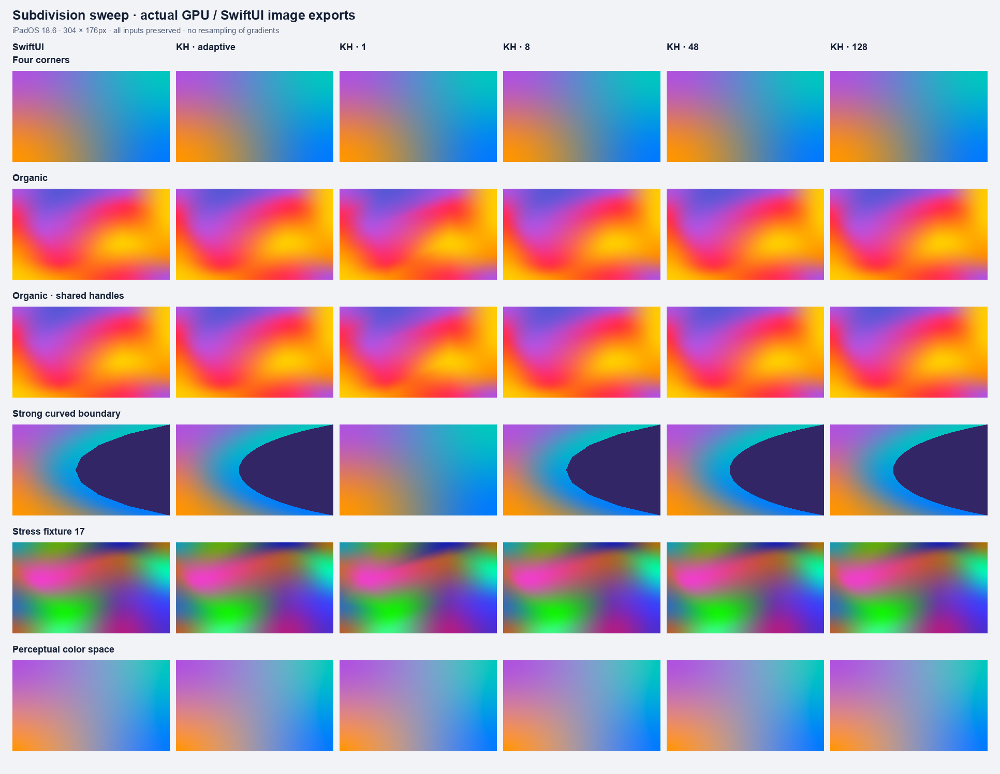
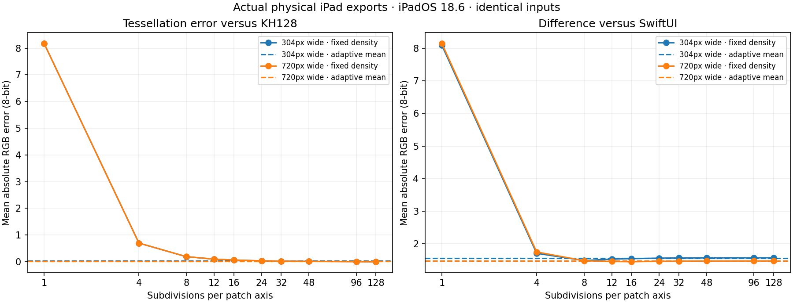

# Adaptive geometry and per-fragment color

Adaptive geometry is now the library default. The vertex shader evaluates
position and forwards patch UV/identity; the fragment shader evaluates the full
cubic color surface. Fixed positive `subdivisions` remains available. Native
UIKit animations, property animators, independent Metal layers, shared command
buffers, and zero recurring GPU work at idle are preserved.

For 60 distinct gradients, the new default reduces the measured GPU command
envelope from **6.42 to 1.85 ms**, extra app footprint from **68.42 to 50.70 MiB**,
and gradient triangles from **2.49 million to about 318,000 per update**:
71% less GPU interval, 26% less extra memory, and 87% fewer triangles.
This is a workload result, not universal efficiency or SwiftUI pixel parity.

## Implementation and API

Color coefficients are cached per palette/interpolation mode. One axis uses
Horner evaluation and the other retains Bernstein controls to limit cancellation.
Opaque device colors use packed half data and a specialized RGB-only shader
with alpha exactly one. Translucent, linear/perceptual, values outside half
range, and Intel Catalyst use float precision. Function constants specialize
the pipelines, eliminating unused precision/conversion paths. No dithering or
private framework dependency is introduced.

Geometry selection bounds pure and mixed second derivatives in framebuffer
pixels. A uniform power-of-two grid prevents cracks on shared patch boundaries.
The mixed derivative catches nonlinear interiors even when edges are straight.
The default target is 0.5 pixels; limits of 128 segments and 65,536 cells can
override it for extreme inputs. It follows presentation geometry during
animation and actual texture dimensions when resized. This is a position target,
not a bound on color/coverage differences.

```swift
gradient.subdivisions = 0 // Adaptive, the new default
gradient.maximumGeometryError = 0.5 // Framebuffer pixels
gradient.subdivisions = 48 // Explicit fixed geometry, still per-pixel colors
gradient.debugMode = .tessellation // Actual selected cells and diagonals
```

The example gallery adds an Adaptive / Fixed 48 control. Opt-in statistics
report `lastSubdivisionCount` and cumulative `triangleCount`, excluding overlays.
Position and color uploads use separate buffers, retained until GPU completion.

## Repeated physical-device measurements

[Results](results.md), [summary](summary.json), [CSV](runs.csv), and raw
[small](raw) / [large](large/raw) trials retain all measurements and hashes.
There are 12 current fresh-process trials: three renderer pairs for each workload,
using one Release executable, the same M1 iPad/iPadOS 18.6, seed-42 distinct
inputs, scale 2, eight seconds of motion, and requested 120 Hz. Renderer order
alternates. Three preserved fixed-48 trials from the [geometry experiment](../Geometry)
provide the before comparison, with exactly matching 60-view inputs.

| Workload | KH / SwiftUI CPU ms/update | KH / SwiftUI extra MiB |
| --- | ---: | ---: |
| 60 × 152×88 pt | 4.90 / 3.36 | 50.70 / 73.06 |
| 15 × 320×200 pt | 2.28 / 3.86 | 56.16 / 91.01 |

KH presents approximately 119.93 frames/s per view in both workloads. SwiftUI
callback rates are 119.31 and 119.81 updates/s, not direct presentation proof.
KH uses one command buffer and eight or two passes respectively. The small
workload usually selects 16 segments, with some meshes/frames at 32; larger
surfaces select 32. Each mesh selects its own geometry and palette.

SwiftUI retains the CPU advantage for 60 small views. For 15 larger views,
KH uses 41% less CPU and 38% less extra footprint in this case. Small-view
KH CPU rises from the preserved baseline's 4.48 to 4.90 ms/update while GPU
cost falls. Adaptation adds CPU calculations; these whole-process measurements
do not isolate the cost of each function.

All primary trials are retained, nominal thermal state, Low Power Mode off,
all views visible, no interruptions/GPU errors, and zero KH idle-after
submissions. CPU is consumed whole-process time, memory is physical footprint
above the fresh blank baseline, and the compositor is excluded.

Separate [GPU profiles](gpu) retain one successful five-second KH capture and
two SwiftUI captures. Additional exports failed repeatedly; KH trace repeat
variation remains unknown. Our unprofiled GPU diagnostics above have three runs.
All successful traces use
the same all-process Metal System Trace mode, and app-only extraction. Profiled
CPU/cadence do not enter primary estimates. Every successful profile has complete
Vertex/Fragment pairs, one buffer/update, zero idle-before buffers, and matching
input/executable hashes. Stages overlap and cannot be added. Trace envelopes
and Metal command-buffer diagnostics have different boundaries and are reported
separately. Device frequency and profiling effects can vary.

Host disk pressure initially prevented one capture from saving. It was repeated.
Transient exporter failures succeeded on retry of the same saved captures.
Additional all-process traces had unrelated daemon timeline/export errors and
could not be analyzed. Their failed exports are excluded. No primary
CPU/memory trial was excluded. Earlier traces were losslessly archived and
verified under ignored `DerivedData/ArchivedProfiles`; current traces/XML remain
under ignored `DerivedData/AdaptiveProfiles`.

## Image quality

The [raw exports](images/raw) contain 360 images: 15 fixtures × two sizes ×
(11 KH settings including adaptive + SwiftUI), with identical inputs preserved
in the manifest. KH uses real Metal textures; SwiftUI references use ImageRenderer.
Exports are independent from onscreen timing. [Metrics](images/metrics.json)
measure encoded-sRGB differences over white/black, plus alpha separately.

Adaptive output differs from its own 128-segment reference by **0.034 channel
values out of 255** on average at 304×176 pixels and **0.016** at 720×480.
Differences from SwiftUI average 1.562 and 1.470 respectively. Shared explicit
handles still reduce automatic-geometry differences; higher density does not
establish SwiftUI identity.

Preserved [float references](validation/float-reference) use the same
128-segment geometry and the initial all-float evaluator. The current specialized
evaluator differs by 0.058 channel values on average over 30 image pairs, with
a maximum composited difference of 1.616. [Precision metrics](validation/precision-comparison.json)
retain per-image maxima/hashes. This includes basis and rounding changes, not
isolated arithmetic precision.

A curved triangle edge can move across a pixel and produce a large local
coverage difference despite small geometric error. Full metrics retain maxima,
p95 and fractions exceeding two channel values. No pixel test was relaxed.
The ordinary nine-pair [comparison sheet](../../Comparisons) and debug captures
were rebuilt; SwiftUI reference PNGs stayed byte-identical.




## Verification and reproduction

The 31-test suite covers analytic cubic color at one cell, alpha/color spaces,
float fallback for extreme inputs, screen-space error, mixed curvature, work
limits, animated geometry, paused policy changes, actual debug diagonals,
all eight render targets, native animation behavior, and idle counters.
See [verification](../../Verification.md) for OS/build configurations. Catalyst
builds for arm64 and x86_64 with deployment target 15.0; pre-iOS-18 runtime testing
remains unverified.

Build/install Release, then run from the repository root:

```sh
python3 Scripts/run_benchmarks.py --device COREDEVICE_ID --counts 60 --meshes organic \
  --width 152 --height 88 --fps 120 --random-seed 42 --repeats 3 --subdivisions 0 \
  --output Documentation/Benchmarks/Adaptive/raw
python3 Scripts/run_benchmarks.py --device COREDEVICE_ID --counts 15 --meshes organic \
  --width 320 --height 200 --fps 120 --random-seed 42 --repeats 3 --subdivisions 0 \
  --output Documentation/Benchmarks/Adaptive/large/raw
python3 Scripts/profile_geometry_benchmarks.py --device COREDEVICE_ID --trace-device DEVICE_UDID \
  --subdivisions 0 --output Documentation/Benchmarks/Adaptive/gpu --raw DerivedData/AdaptiveProfiles
python3 Scripts/analyze_adaptive_benchmarks.py
```

Launch with `--export-geometry`, copy `Documents/GeometryExperiment`, and pass
that folder to `Scripts/analyze_geometry_images.py --output OUTPUT_FOLDER`.
For the before renderer, check out `65ec8ff` and use an independent output folder.
Never overwrite preserved baseline data with the current shader.
