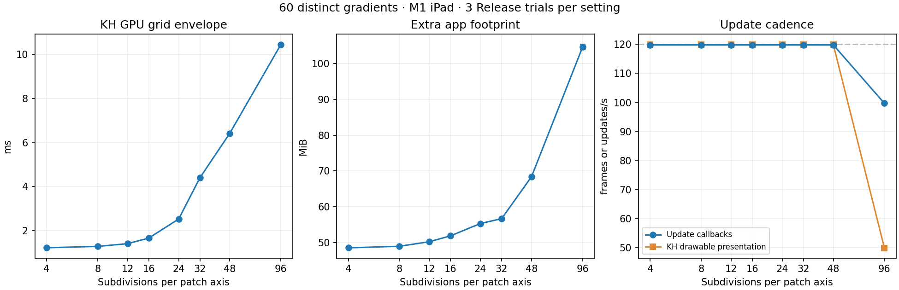
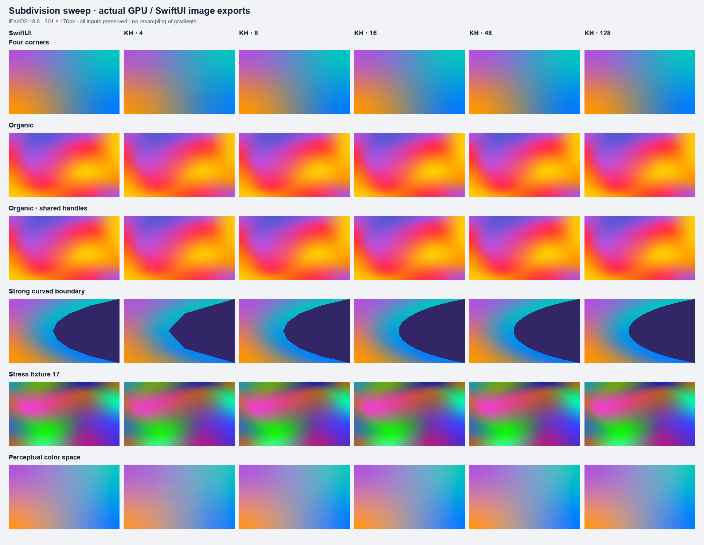
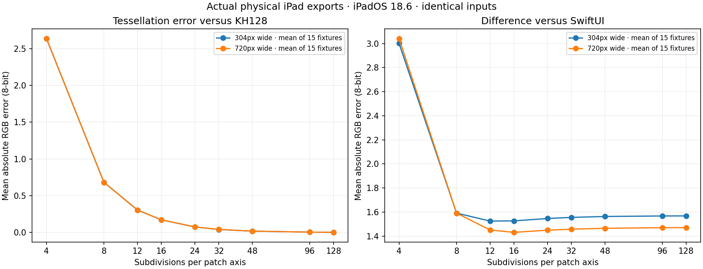

# Geometry density, image convergence, and SwiftUI internals

These are preserved experiments at commit `65ec8ff`. The
[adaptive renderer report](../Adaptive/README.md) covers the implementation that
followed. Check out that commit to reproduce the original measurements below.

Fixed tessellation density explains a large part of the remaining KH GPU cost.
Reducing each patch from 48 to 16 subdivisions cuts its triangle count by 89%,
the measured 60-view GPU command envelope by 74%, and extra app footprint by 24%.
The library's default remains 48; this experiment changes example configurations
and measurement tools, not the shipped renderer or its quality policy.

There is also a confirmed architectural difference: the inspected SwiftUI
RenderBox implementation chooses geometry density from curvature and rendering
scale, and evaluates cubic color in the fragment shader. KH currently evaluates
both position and color at vertices, then linearly interpolates the resulting
colors across its triangles. Lowering KH density therefore affects color quality
as well as curved geometry. Matching SwiftUI's very low geometry counts requires
decoupling those two jobs.

## Repeated physical-device measurements

The [full results](results.md), [raw trials](raw), [CSV](runs.csv), and
[validated summary](summary.json) contain 27 unprofiled fresh-process trials:
eight KH subdivision settings and a SwiftUI control, three runs each.
The same M1 iPad/iPadOS 18.6, Release executable, 60 distinct seed-42 meshes,
152×88 pt cells, scale 2, eight seconds of motion, and 120 Hz request are used
throughout. Density order reverses in the second repetition. All inputs and
source/executable hashes match. Every trial stays at nominal thermal state,
with Low Power Mode off, no interruptions, all 60 meshes visible, and no GPU
errors. All KH idle-after phases submit zero frames.

| KH subdivisions | GPU batch envelope ms | Extra app MiB | Actual KH presentation/s |
| --- | ---: | ---: | ---: |
| 8 | 1.28 ± 0.00 | 48.94 ± 0.08 | 119.93 |
| 16 | 1.66 ± 0.00 | 51.87 ± 0.05 | 119.93 |
| 48 | 6.42 ± 0.06 | 68.42 ± 0.22 | 119.93 |
| 96 | 10.45 ± 0.01 | 104.69 ± 0.72 | 49.91 |

CPU does not improve with lower density in this experiment: KH/16 consumes
4.78 ± 0.02 ms/update, KH/48 4.48 ± 0.09, and SwiftUI 3.39 ± 0.02. CPU is
whole-process consumed time, not a GPU duration. At 96, callbacks still average
99.7/s while presentation falls to 49.9/s; callbacks alone hide that loss.



Six separate Metal System Trace profiles compare KH/16 with SwiftUI, three
fresh processes each, using the same all-process capture mode and app-only
extraction. Their mean vertex/fragment command envelopes are **1.437 ± 0.067 ms
for KH/16 and 1.811 ± 0.037 ms for SwiftUI**. GPU Active unions are 1.132 ± 0.006
and 1.709 ± 0.007 ms/update. This gives KH/16 a lower observed GPU interval in
this workload, with the image differences below; it is not universal parity.
The compositor is excluded. Device frequency and profiling can affect results.

Trace stage envelopes and Metal command-buffer start/end diagnostics have
different boundaries, so their numbers are presented separately. Profiling
CPU/cadence do not enter the primary sweep. All six successful profiles have
complete Vertex/Fragment pairs, matching inputs/build, one app buffer/update,
zero idle-before buffers, and nominal thermal state. Raw traces/XML remain in
ignored DerivedData; [public GPU summaries](gpu) contain aggregates only.

## Pixel output at different densities

The physical iPad exported **300 images**: 15 fixtures × two sizes × (nine KH
densities + SwiftUI). Sizes are 304×176 and 720×480 pixels, scale 1. Fixtures
cover regular/automatic geometry, matching explicit handles, strongly curved
boundaries, backgrounds, transparency, unsmoothed colors, perceptual color,
and three actual randomized stress fixtures. Full inputs, original PNGs, and
image hashes are preserved in [raw exports](images/raw) and
[metrics](images/metrics.json).

KH images render into real Metal textures; SwiftUI references use ImageRenderer.
These are image comparisons, independent from onscreen performance and the
runtime debugger probe. SwiftUI controls its own tessellation; it has no public
subdivision setting. KH/128 estimates convergence, rather than ground truth.
Errors are measured in encoded-sRGB 8-bit channel values, composited over both
white and black, with alpha measured separately.

| KH subdivisions | Mean RGB error vs KH128, small / large | Mean RGB difference vs SwiftUI, small / large |
| --- | ---: | ---: |
| 4 | 2.637 / 2.637 | 3.000 / 3.040 |
| 8 | 0.681 / 0.682 | 1.591 / 1.591 |
| 16 | 0.171 / 0.171 | 1.527 / 1.431 |
| 48 | 0.016 / 0.017 | 1.563 / 1.465 |
| 96 | 0.003 / 0.003 | 1.567 / 1.470 |

The average is equally weighted over 15 fixtures at each size. Higher density
converges to our own output but does not converge to SwiftUI. Automatic-handle
inference remains significant: for the small organic fixture, supplying matching
explicit handles reduces KH128's difference from 2.249 to 0.841 channel values.
For the warped fixture it drops from 3.696 to 1.091.

Mean error is not a guarantee for each pixel. The strong curved boundary at
KH/16 differs from KH128 by up to 161 channel values at small resolution because
coverage can change across an edge; its average error is 0.387. Some such pixels
remain at high density. The full metrics retain p95, maximum, and the fraction
of pixels exceeding two channel values. Perceptual color also shows larger
local errors than ordinary device-color interiors. A future automatic policy
needs a geometric error criterion and image validation, not just a lower default.




## Binary inspection and actual runtime geometry

Apple publicly documents that MeshGradient creates tessellated Bézier patches:
[MeshGradient documentation](https://developer.apple.com/documentation/swiftui/meshgradient).
We then inspected local **RenderBox**, the rendering framework reached by
SwiftUI, rather than guessing from the API's control points.

Static inspection covers iOS 18.2 and 26.5 Simulator binaries. Both contain
`RB::Fill::MeshGradient::PatchBuffer::commit_patch` and `make_buffers`.
The patch builder gathers maximum absolute second control-point differences
along each axis, over visible patches. The buffer builder combines that
curvature with transform scale, rounds subdivision depth upward in powers of
two, caps depth at seven, and reduces it if the total cell count would exceed
65,536. The observed choice is uniform across a mesh's retained patches;
this evidence does not show independent recursive refinement of each patch.

For the observed ordinary patch branch, the reconstructed arithmetic is:

```text
curvature = length(maximumSecondDifferenceXY)
depth = min(7, ceil(log2(max(1, sqrt(0.25 * transformScale * curvature)))))
subdivisions = 2^depth
reduce depth while retainedPatchCount * subdivisions^2 > 65536
```

An LLDB probe read the generated depth, retained patch count, curvature, and
scale during **actual onscreen rendering on iOS 26.5 Simulator**:

| SwiftUI fixture | 152×88 pt at scale 2 | 360×240 pt at scale 2 |
| --- | ---: | ---: |
| Straight four-corner patch, smooth color | 1 | 1 |
| Organic automatic geometry | 4 | 8 |
| Organic with explicit shared handles | 4 | 8 |
| Strong curved boundary | 8 | 16 |
| Regular grid, unsmoothed color | 1 | 1 |

The probe also sampled 120 mesh-buffer builds from the randomized 60-view
stress scene: **82 used 4 subdivisions and 38 used 8**, all with nine patches.
The reconstructed formula exactly predicts all 130 observations.
[Runtime observations](runtime/observations.json),
[stress observations](runtime/stress-observations.json), and static metadata
record the verified framework UUIDs and hashes. Runtime inference is specific
to that build; this is not a debugger measurement of the iPadOS 18.6 device.

The iOS 18.2 Simulator Metal library contains readable AIR/LLVM bitcode for
`accumulator_mesh_gradient_vertex` and `accumulator_mesh_gradient_fragment`.
Its vertex shader passes patch coordinates/identity to the fragment stage.
The fragment's `sample_mesh_gradient` evaluates cubic colors using half-vector
multiply-adds; its linear-color branch performs bilinear interpolation per
fragment. It also samples a repeating noise texture and adds approximately
±1/255 RGB noise scaled by alpha. KH has no corresponding dithering step.
This is direct shader inspection, not a conclusion drawn from timing alone.
It explains how the inspected renderer can retain smooth colors on a straight
patch with one geometry cell. Geometry quantization, color construction,
dithering, and rasterization can still produce image differences.

Only research tooling reads private framework state. The app/library contain
no private selectors, calls, swizzling, or copied framework implementation.
Extracted instructions and Apple shader code stay in ignored DerivedData;
public artifacts contain our analysis, symbols/hashes, and numeric observations.

## Reproduction

Build/install the Release example on a paired physical device, then:

```sh
python3 Scripts/run_geometry_benchmarks.py --device COREDEVICE_ID
python3 Scripts/profile_geometry_benchmarks.py --device COREDEVICE_ID --trace-device DEVICE_UDID
python3 Scripts/analyze_geometry_benchmarks.py
```

Launch the example with `--export-geometry`; copy its generated
`Documents/GeometryExperiment` directory to a chosen output folder. Then:

```sh
python3 Scripts/analyze_geometry_images.py EXPORTED_DIRECTORY
```

For static research, supply installed local framework paths:

```sh
python3 Scripts/inspect_renderbox_geometry.py --binary RENDERBOX_BINARY --library RENDERBOX_METALLIB
```

For runtime research, launch the Simulator example with `--probe-swiftui-geometry`
and wait for a debugger. At `UIApplicationMain`, use LLDB's
`expression -l objc -- (int)setvbuf(__stdoutp, (char *)0, 2, 0)` to flush markers,
remove that launch breakpoint, import `Scripts/probe_renderbox_geometry_lldb.py`,
and call its `install(lldb.debugger, STDOUT_PATH, OUTPUT_PATH)`. Continue;
the probe stops after the final case so it can be detached. The script rejects
unverified framework UUIDs. For the stress scene, launch the existing SwiftUI
benchmark arguments and supply a `case_label` and `maximum_observations=120`
to `install`. Never use debugger runs as performance measurements.

The existing 23 tests pass on iOS 26.5 Simulator after adding the diagnostic
example modes. No library shaders, tessellation defaults, or pixel tests changed.
