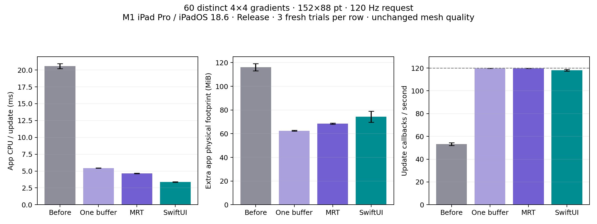

# Batched renderer optimization

The current renderer reaches the requested 120 Hz workload while keeping the
original mesh quality. For 60 unique gradients, whole-app CPU falls from
20.58 ± 0.36 to 4.64 ± 0.05 ms/update, extra app footprint falls from
116.05 ± 3.04 to 68.47 ± 0.42 MiB, and actual KH presentation cadence rises from
53.3 to 119.9 frames/s per view. CPU is 77% lower and extra memory is 41% lower.

With diagnostics disabled, the current library consumes 4.48 ± 0.04 ms/update.
The paired SwiftUI scene consumes 3.38 ± 0.03 ms/update and
74.40 ± 4.64 MiB extra app footprint. We now match the requested update cadence
and have a lower mean footprint in this case, but SwiftUI still uses less CPU.
This is a workload-specific result, not universal efficiency parity.



The [results table](results.md), [summary](summary.json), [CSV](runs.csv), and raw
trials retain the variation, input manifests, environment, and build hashes.

## Changes

- Dirty views share one command buffer and one scheduling wait inside the
  original Core Animation display transaction.
- Compatible native drawable sizes share passes with up to eight independent
  color attachments. The 60-view scene uses eight passes instead of 60.
- Indexed triangles reuse adjacent vertices. The original triangle order,
  48 subdivisions, geometry, color interpolation, transparency, and debugging
  are preserved.
- Upload buffers are reused only after GPU completion, with a bounded idle cache.
- Ordinary updates use cached model snapshots, avoiding per-vertex KVC traffic.
  Animation still uses presentation-layer interpolation and native UIKit actions.
- Color resolution/control nets are cached, and geometry boundary vectors use
  stack SIMD matrices instead of temporary arrays.

Every view remains a native CAMetalLayer-backed UIView. Its framebuffer-only
texture, alpha, transform, clipping, and lifetime are independent. There is no
permanent library display link, fixed FPS clock, atlas, or image reuse between
views. Idle-after phases submit zero frames in every published KH trial.

## Matched measurements

Measured 7 October 2026 on the physical M1 iPad Pro, iPadOS 18.6, landscape
1590×1192 pt at scale 2, using Release builds from Xcode 26.6. All 60 visible
152×88 pt gradients have distinct palettes and initial interior geometry from
seed 42. Every pair uses identical inputs, smoothing, device color space,
trajectory, phase offsets, dimensions, and the original 48-subdivision setting.
Random generation and input hashing happen before timing.

Three fresh-process renderer pairs were captured for the original library
([before](before/raw)), an intermediate command-batched implementation
([after](after/raw)), and the final multi-target implementation ([final](final/raw)).
The original library includes the previous UIViewPropertyAnimator integration.
Each stage uses one executable for both renderers. Three KH-only diagnostic-off
controls were captured for the intermediate and final executables. This gives
24 unprofiled fresh-process trials. Renderer order alternates between repetitions.
No primary trial is discarded. Every trial stays at nominal thermal state, with
Low Power Mode off, no interruptions, all meshes visible, and no GPU errors.

The scene's input arrays and individual/combined hashes match exactly across all
stages and controls. Shader/pipeline changes require different build hashes
between stages; those hashes are retained rather than combining executables
silently. Variation here measures repeat variation at one fixed seed. Earlier
[three-seed randomized measurements](../Randomized/README.md) are preserved.

The [existing measurement method](../README.md#measurement-method) applies:
whole-process user+system CPU per update, TASK_VM_INFO physical footprint above
the fresh blank baseline, eight seconds of measured motion, and sampled thermal,
power, layout, and app state. Callback cadence is not SwiftUI presentation proof.
KH's drawable timestamps independently establish its presentation rate. CPU and
footprint are app-attributed; the system compositor is excluded.

MRT trades approximately 6 MiB of additional cached pipeline/driver state against
lower CPU cost compared with command batching alone. Experimental atlas variants
were rejected after increasing active footprint substantially. Two drawables per
layer reduced this scene to 60 Hz, so the shipped renderer retains triple buffering.
Those exploratory runs do not contribute to the repeated result estimates.

## GPU scopes

Opt-in diagnostics allocate each completed batch command-buffer envelope equally
among all participating views. Summing their shares gives the scene envelope;
it does not measure isolated per-mesh GPU work. The current three-run mean is
6.39 ± 0.08 ms per scene command-buffer envelope. This is a GPU interval, not
consumed CPU time or end-to-end display latency.

The original renderer's separate command-buffer envelopes overlap. Their sum
must not be treated as an overlap-free GPU cost for the scene. Separate Metal
System Trace profiles exclude the compositor and retain stage envelopes and the
union of app Active intervals; their CPU/cadence are excluded from the primary
measurements. The fresh profiles observe 6.253 ms mean command envelope / 5.202 ms Active
union per KH update, versus 1.798 ms / 1.714 ms for SwiftUI.
SwiftUI still uses less GPU time. See the [GPU results](gpu/results.md) and
[sanitized summaries](gpu).

`commandBufferCount` and `renderPassCount` are fractional per-view contributions;
sum them across all participants with diagnostics enabled. Diagnostic-off controls
have no buffer/pass timing measurements, although their successful onscreen view
submission counts still establish that meshes actually redraw.

## Rendering and runtime verification

All 29 exported gradient, debug, and SwiftUI-reference images were regenerated
on iOS 26.5. Every before/after pixel matches exactly; see the
[pixel validation](validation/before-after-pixels.json). The
[comparison sheets](../../Comparisons/README.md) were rebuilt. This establishes
preserved output for those fixtures, not pixel identity with SwiftUI.

The suite has 23 passing tests on iOS 18.2 and 26.5 Simulator and the physical
iPad running iPadOS 18.6 in Release. The standalone Mac Catalyst Release build
also passes. New tests verify
shared command buffers/passes, zero idle submissions, multiple animated views
scrubbing together, and all eight fragment-output slots with distinct palettes,
transparency, backgrounds, debug overlays, and a differently sized target.
Batched GPU pixels match independently rendered references exactly.

## Reproduction

Build/install the Release example, then run from the repository root:

```sh
python3 Scripts/run_benchmarks.py --device DEVICE_ID --counts 60 --meshes organic \
  --width 152 --height 88 --fps 120 --repeats 3 --random-seed 42 \
  --output Documentation/Benchmarks/Optimized/final/raw
python3 Scripts/run_benchmarks.py --device DEVICE_ID --counts 60 --meshes organic \
  --width 152 --height 88 --fps 120 --repeats 3 --random-seed 42 --renderers kh \
  --no-metal-statistics --output Documentation/Benchmarks/Optimized/final/controls
python3 Scripts/analyze_optimized_benchmarks.py
```

Existing output files are reused; use a new folder or `--overwrite` for fresh runs.
For the original implementation, check out local commit `e71168a`, rebuild/install,
and write trials to a separate baseline folder. The published baseline inputs and
measurements remain preserved. Identifiers and signing settings are local CLI
inputs, not committed project configuration.
