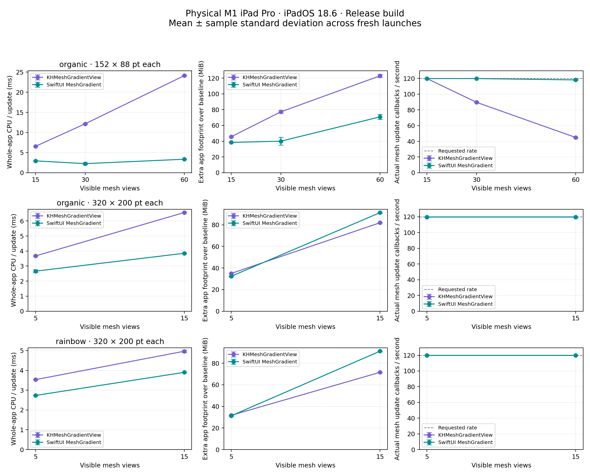

# Physical-device performance comparison

SwiftUI uses less whole-app CPU time in every measured workload. KH has a memory
advantage at 15 larger surfaces, but loses that advantage in the high-count small
surface workload. At 120 Hz, 30 and 60 independent KH views expose a clear update
bottleneck. The static KH renderer submits no new GPU work after settling.

| Organic workload | KH / SwiftUI CPU ms per update | KH / SwiftUI extra app MiB | KH / SwiftUI updates per second |
| --- | ---: | ---: | ---: |
| 15 × 320×200 pt | 6.56 / 3.85 | 81.91 / 91.27 | 119.8 / 119.8 |
| 15 × 152×88 pt | 6.56 / 2.95 | 45.69 / 38.44 | 119.8 / 119.8 |
| 30 × 152×88 pt | 12.16 / 2.26 | 77.24 / 40.02 | 89.6 / 119.8 |
| 60 × 152×88 pt | 24.12 / 3.36 | 122.84 / 70.82 | 44.8 / 118.1 |

The 30-view SwiftUI case has five trials: CPU ranges 2.04–2.71 ms/update and extra
footprint 34.99–45.75 MiB. The other cases have three trials and CPU variation
below 4% coefficient of variation. The variability is retained in the results.
Disabling KH diagnostics changes mean CPU by at most 0.5% across the four control
workloads and leaves the stress bottleneck in place; this is within trial noise.

For the larger organic surfaces, the measured 5→15 increase corresponds to
approximately 4.70 extra app MiB per additional KH view versus 5.90 for SwiftUI.
For 30→60 small surfaces it is approximately 1.52 versus 1.03 MiB. These are
local slopes for these layouts and allocation policies, not universal per-view
constants. Static idle retains resources; memory does not fall to the blank
baseline when animation stops.



The [full results](results.md) include mean, sample standard deviation, total and
incremental memory, callback p95, direct KH rendering stages, and controls with
diagnostics disabled. [Raw trials](raw), [CSV](runs.csv), and [machine-readable
summary](summary.json) preserve the measurements rather than just rounded claims.

A [randomized 60-view follow-up](Randomized/README.md) repeats the stress case with
a unique palette and initial interior geometry for every view, plus original-input
controls in the same new build. Randomizing the inputs leaves the measured CPU,
memory, and update-rate advantage essentially unchanged. The earlier sweep and
its executable fingerprints remain preserved here.

## Workloads and device

Measured 7 October 2026 on a physical M1 iPad Pro 12.9-inch (5th generation),
iPadOS 18.6, display scale 2, maximum refresh rate 120 Hz, Release build using
Xcode 26.6. The primary sweep has three fresh-process repetitions of each case,
with renderer and case order reversed in the middle repetition. The variable
30-view SwiftUI case receives two additional trials; none are discarded.
The app viewport is 1590×1192 points in landscape at the device's current display
configuration, consistent across every primary trial. Large grids use four
columns; small grids use nine. The device is tethered during measurement.

The larger surfaces are 320×200 points each, with 5 and 15 views. They use the
rainbow 3×3 and irregular organic 4×4 fixtures from the comparison gallery.
The stress series uses the same organic fixture at 152×88 points, with 15, 30,
and 60 visible views. Surface size is held constant within each series. Reducing
surface size lets every stress view fit onscreen: no hidden, offscreen, or stacked
copies inflate the count. Do not compare 15 large and 30 small views as if they
were the same pixel workload.

Every view's interior mesh points move on the same time-based sinusoidal
trajectory, with an independent phase offset per view. Colors, device color
space, smoothing, topology, size, and update time are matched. KH uses its
default 48 subdivisions per patch axis. SwiftUI chooses its own rendering
quality internally. The renderers are independent and are not pixel-identical;
see the [actual image comparisons](../Comparisons/README.md).

This workload assigns points each callback with no implicit mesh animation.
It measures repeated public-API updates plus rendering. A single long
`UIView.animate` or SwiftUI interpolated animation has a different CPU path;
these results do not measure every supported animation style.

The benchmark requests 120 Hz using both the example's
`CADisableMinimumFrameDurationOnPhone = true` and
`CAFrameRateRange(minimum: 120, maximum: 120, preferred: 120)` on its display link.
The request is a hint; measurements record actual callbacks and gaps. See
[Apple's ProMotion guidance](https://developer.apple.com/documentation/quartzcore/optimizing-iphone-and-ipad-apps-to-support-promotion-displays).
This clock is confined to the benchmark. The library still renders on demand.

## Measurement method

Each trial creates just one renderer's scene in a fresh process. SwiftUI uses
one `UIHostingController` containing all independent observed mesh views, rather
than paying for a hosting controller per mesh. The ordinary gallery is never
constructed in benchmark mode.

The phases are: blank baseline 2 s; construction and warmup 2 s; static idle 3 s;
moving warmup 1 s; measured motion 8 s; settling 1 s; static idle after motion 3 s.
The benchmark checks thermal state, Low Power Mode, active-app interruptions,
and whether every mesh rectangle fits. Primary measurements run without
Instruments, debugger attachment, or screen streaming. GPU profiles are separate
runs and never contribute CPU or footprint numbers to the primary sweep.

Whole-app CPU comes from `getrusage` user + system time across all app threads,
divided by the number of mesh updates. It includes SwiftUI's deferred view and
render work, KH's property setters and Metal encoding, and shared measurement
overhead. It is not the duration of a SwiftUI state assignment. CPU percentage
uses one core as 100%, so multiple threads can exceed 100%. CPU milliseconds per
update are consumed CPU time, not end-to-end frame latency or a single main-thread
budget. CPU in other processes, including the compositor, is excluded. Raw setter
wall times are preserved separately.

App memory uses `TASK_VM_INFO.phys_footprint`, sampled every 0.25 s. Extra footprint
subtracts that same fresh process's blank-scene baseline. Total footprint and
RSS are also preserved. These numbers describe app-attributed process memory,
not every allocation in the system compositor/RenderServer. An average extra
MiB/view includes shared startup and pipeline costs and is not a marginal cost
for adding one view. Allocator pools, drawable counts, batching, and GPU/CPU
frequency scaling can make scaling non-linear; a lower memory sample at a higher
count is not proof that adding views frees memory.

CADisplayLink callback gaps measure update cadence and missed requested slots.
They do not prove that SwiftUI presented every update or report GPU rendering
time. KH's drawable presentation timestamps separately verify its displayed
cadence on the physical device. The direct GPU profiles below establish real
SwiftUI rendering activity. Neither measurement claims full touch-to-photon
latency, energy usage, or a universal performance ranking.

Primary KH trials enable opt-in aggregate command-buffer and presentation
diagnostics. Additional trials disable those callbacks while retaining the same
whole-app monitor. The results table shows their cost explicitly. All trials
use the same executable; source and executable SHA-256 hashes are recorded.

## Direct GPU measurement

SwiftUI's GPU work is accessible through Instruments Metal System Trace even
though it does not expose its command buffers publicly. The extraction groups
depth-zero app Vertex/Fragment Active intervals by command-buffer ID, requires
both stages, and measures the envelope from the earliest start to latest end.
It excludes system compositor buffers and incomplete samples. Vertex and
fragment work can overlap, so their durations must not be added.

The sanitized [GPU aggregates](gpu) retain counts, coverage, and mean/median/p95
GPU command intervals. A command buffer can represent one mesh or a batch of
meshes. Check the observed buffers/update before calling a buffer a mesh draw;
there is no assumed one-buffer-per-view relationship for SwiftUI.

The 60-view SwiftUI profile records **one complete command buffer per update**
for the whole visible grid, with a mean interval of 1.218 ms and p95 of 1.738 ms.
KH submits one buffer per view. This is evidence consistent with scene batching
in this SwiftUI layout and explains why command-buffer time must not be called
per-mesh time indiscriminately. In the 15-large-view profile, SwiftUI has multiple
buffers per update: mean 0.295 ms, median 0.201 ms, p95 0.871 ms. KH's corresponding
complete-buffer mean is 0.542 ms, median 0.574 ms, p95 0.591 ms. The native profile's
longer tail is retained, not hidden behind its lower mean.

The KH 15-view trace mean agrees within 0.3% with its public Metal command-buffer
timestamps (0.543 ms over all 21,585 buffers). The trace contains only 11,511
complete Vertex/Fragment pairs; SwiftUI contains 13,565 complete of 19,070
observed buffers. Missing stages limit these profile distributions. The full
results also give the union of captured app Active intervals per update, counting
overlapping stages once; missing intervals can underestimate this observed
activity. These are single 12-second profiles for each renderer/layout, not
three-run GPU confidence estimates. Do not add individual buffer intervals to
produce a whole-scene frame time.

Raw `.trace`/XML exports are kept locally under ignored DerivedData because they
include unrelated device and process metadata. Primary trials contain no
personal device names, serial numbers, or device identifiers. Instruments can
change scheduling and frequency; GPU profiles are supplemental, not replacements
for the repeated unprofiled process measurements.

## Visual and idle validation

The [before](layout-validation/swiftui-60-simulator.jpg) and
[after](layout-validation/swiftui-60-simulator-after.jpg) simulator captures show
the eager six-column, ten-row SwiftUI grid. Every cell changes across the motion
phase. These validate layout and state propagation; their simulator timings are
not included in the physical-device results.

Separate screenshots from the actual benchmark iPad verify the nine-column
60-view layout for both [KH](layout-validation/kh-60-device.png) and
[SwiftUI](layout-validation/swiftui-60-device.png). They were taken after the
timed runs and do not contaminate them.

KH's static phases record zero onscreen submissions after settling, including
after the 60-view stress case. The benchmark monitor itself continues ticking
during idle so both versions pay the same monitoring cost. This is not a claim
of zero process CPU or zero retained memory: static views retain their last
rendered images and resources. The three-second idle phases do not constitute
a long-running leak test.
Both renderers' GPU profiles also record zero app command buffers during the
three-second idle-before phase. The measurements do not establish a unique
idle-rendering advantage for KH.

At 60 KH views, the point-assignment loop alone takes approximately 13 ms before
layer redisplay and encoding. At 120 Hz the requested interval is 8.33 ms. This
is actionable evidence for optimizing repeated geometry/color processing and
the per-vertex Core Animation property bridge. It does not establish which
internal SwiftUI algorithm provides its advantage.

## Reproduce

Build/install the Release example on a connected ProMotion device, setting your
own signing team in Xcode. The runner uses a device identifier supplied on the
command line; it does not save that identifier in the public results.

```sh
python3 -m pip install -r Scripts/requirements.txt
python3 Scripts/run_benchmarks.py --device DEVICE_ID --suite primary120 --repeats 3
python3 Scripts/analyze_benchmarks.py
python3 Scripts/write_benchmark_tables.py

# Optional controls, written separately from the primary trials:
python3 Scripts/run_benchmarks.py --device DEVICE_ID --renderers kh \
  --meshes organic --counts 15,30,60 --width 152 --height 88 --fps 120 \
  --no-metal-statistics --repeats 3 --output Documentation/Benchmarks/controls/raw
python3 Scripts/analyze_benchmarks.py --raw Documentation/Benchmarks/controls/raw \
  --output Documentation/Benchmarks/controls
python3 Scripts/write_benchmark_tables.py
```

For a GPU profile, launch with `--bench-delay 12 --bench-seconds 12` to leave time
to attach Instruments. Record Metal System Trace for 34 s, then export the
`time-info` and `metal-gpu-intervals` tables using `xctrace export`. Copy the run's
JSON from the app's Documents/Benchmarks directory. Extract its active interval:

```sh
python3 Scripts/analyze_gpu_trace.py --time time.xml --gpu gpu.xml \
  --run run.json --output gpu-summary.json
```

Prefer redirecting `xctrace export` stdout to the XML file. In the 60-view KH
capture, its `--output` export reported success but produced truncated XML;
redirecting stdout recovered the complete export. The analyzer rejects malformed
XML rather than accepting the partial result. For example:

```sh
xcrun xctrace export --input capture.trace \
  --xpath '/trace-toc/run[@number="1"]/data/table[@schema="metal-gpu-intervals"]' > gpu.xml
xcrun xctrace export --input capture.trace \
  --xpath '/trace-toc/run[@number="1"]/data/table[@schema="time-info"]' > time.xml
```

The scripts assume the device build at
`DerivedData/BenchmarkDevice/Build/Products/Release-iphoneos`. Existing run files
are reused; use a new output directory or `--overwrite` for a new experiment.
The runner verifies a per-launch token so a stale file on the device cannot be
mistaken for a fresh result. Results are workload/device-specific, and SwiftUI
may change with OS releases. SwiftUI's breaking point beyond 60 views has not
been established by this sweep.
