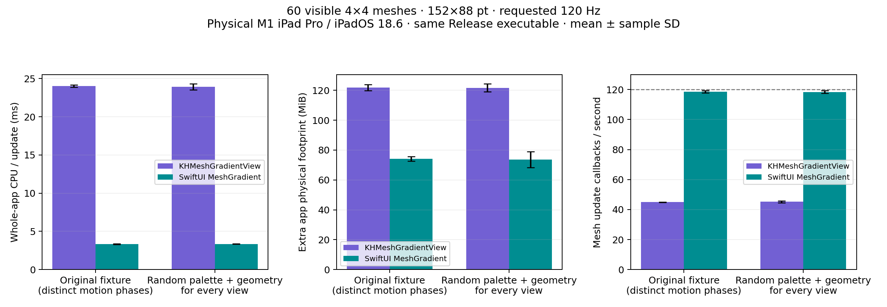

# Randomized 60-view stress test

The original scene shared a palette and initial geometry, but every view had an
independent motion phase. It was not 60 identical live images. This follow-up
changes every view's palette and initial interior geometry to test whether shared
inputs explain SwiftUI's advantage.

The unprofiled measurements show essentially unchanged performance after
randomization. For 60 unique gradients, KH consumes 23.92 ± 0.39 ms of app CPU per
update versus SwiftUI's 3.34 ± 0.02 ms. Extra app physical footprint is
121.66 ± 2.67 MiB versus 73.73 ± 5.33 MiB. KH updates at 45.2 ± 0.6 callbacks/s
versus SwiftUI's 118.4 ± 0.9. These are callback rates, not a claim that every
SwiftUI update reached the display. KH's presentation timestamps are recorded
separately. Frame-count and GPU measurements have their own scopes.



The [full results](results.md), [raw trials](raw), [CSV](runs.csv), and
[summary](summary.json) retain the measurements and variation. The CPU advantage
remains about sevenfold for this repeated-points workload; this is specific to
these implementations, settings, layout, and device.

## Matched experiment

Measured 7 October 2026 on the same physical M1 iPad Pro, iPadOS 18.6, landscape
1590×1192-point viewport at scale 2. There are 60 visible 152×88-point meshes,
each with a 4×4 grid. Smoothing, device color space, opacity, view layout, motion
amplitude/frequency, requested 120 Hz, and KH's 48 subdivisions stay fixed.

Three paired randomized trials use seeds 42, 2026, and 8675309. Each seed produces
60 unique fixtures, verified by SHA-256. Every vertex receives a random palette
color; interior positions receive bounded ±0.045 normalized-coordinate jitter.
The existing sinusoidal interior motion continues for every view, with independent
phase offsets. Border positions are fixed, and the grid topology is preserved.
Colors are held fixed during motion, just as in the original workload.

The seeded SplitMix64 generator, color construction, and fixture hashing run
before the timed phases. No random-number generation is added to the timed
update loop. The prepared inputs are held in the blank-process baseline; the
incremental footprint excludes those input objects for both versions.

Three additional paired trials repeat the original fixture in the **same new
Release executable**, giving 12 fresh processes total. Variant order and renderer
order alternate. All trials remain at nominal thermal state, with Low Power Mode
off, no interruptions, and every mesh rectangle visible. Each renderer pair
has exactly matching point/color arrays and manifest hashes. The library renderer
sources are unchanged; this modifies the example's benchmark inputs only.

Variation in the randomized group includes both run variation and differences
between the three input seeds. The measurements use the original
[process CPU/footprint method and phase durations](../README.md#measurement-method).
The new build's SHA-256 is recorded in the results; the earlier sweep remains
preserved rather than being silently replaced.

## Command buffers and reuse

A Metal command buffer is a submission containing encoded work. It can contain
multiple render passes and draw commands with different geometry and resources.
One command buffer therefore does not mean one gradient draw or one image
repeated 60 times. [Apple's command organization guide](https://developer.apple.com/library/archive/documentation/Miscellaneous/Conceptual/MetalProgrammingGuide/Cmd-Submiss/Cmd-Submiss.html)

These traces report command-buffer activity, not the exact number of draw calls,
instances, or cache hits inside SwiftUI. The renderer can reuse shader programs,
pipelines, and shared resources while still producing distinct gradients. The
randomized scene prevents interpreting its visible output as copies of one
identical gradient image. The separate GPU profiles use seed 42 and do not supply
the CPU/memory numbers above.

With all 60 palettes and interior geometries unique, SwiftUI still records
**one command buffer per update**: 1,439 updates and 1,439 complete Vertex/Fragment
buffers over 12 seconds. Its mean command envelope is 1.811 ms, median 1.788 ms,
and p95 2.015 ms. The observed union of app GPU Active stages is 1.725 ms/update.
There are zero app buffers in the three-second idle-before phase. The fixture
hash matches the unprofiled seed-42 trials exactly.

This supports coalescing distinct mesh work into one submission; it does not
support explaining the scene as one identical gradient image copied 60 times.
It does not establish whether SwiftUI uses many draws, instancing, a shader that
handles multiple meshes, cached intermediate data, or a combination of these.
The earlier shared-fixture GPU profile averaged 1.218 ms per scene buffer. The
randomized GPU profile is more expensive, even though the repeated process CPU,
memory, and callback results are similar. Both are single profiles taken at
different times/builds; GPU frequency and profiling overhead can change, so that
GPU difference is not a controlled three-run estimate of randomization's cost.

The matching KH profile observes 28,560 buffers for 476 updates: exactly 60
buffers/update. It retains 20,268 complete Vertex/Fragment pairs, with a mean
envelope of 0.249 ms **per mesh buffer**; this is not comparable to SwiftUI's
whole-grid buffer mean as a per-mesh measurement. The union of captured app
Active stages is 9.189 ms/update, versus SwiftUI's 1.725 ms/update. This union
counts overlaps once and can underestimate activity when stages are missing.
Profiling slows KH's update cadence, so its profiled rate is not substituted for
the unprofiled results. Both profiles report nominal thermal state, no Low Power
Mode or interruptions, identical seed/input hashes, and zero idle-before buffers.

Two initial GPU saves failed because the host disk filled; they are excluded.
Only successfully saved traces with complete XML exports supply these GPU
aggregates. The process CPU/memory trials finished before profiling and are
unaffected by those failed saves.

## Validation and reproduction

The [simulator capture](validation/swiftui-seed42-simulator.jpg) shows all 60
different palettes and confirms state propagation. Simulator timings are excluded
from this performance report. Raw trials include every view's input arrays,
individual hashes, the scene hash, seed, unique count, and executable/source hashes.

The [physical iPad screenshot](validation/swiftui-seed42-device.png) additionally
shows all 60 distinct gradients in the measured nine-column layout. It was
captured after the timed phases, without screen streaming during measurement.

Build and install the Release example, then run from the repository root:

```sh
# Same-build original-input controls:
python3 Scripts/run_benchmarks.py --device DEVICE_ID --counts 60 --meshes organic \
  --width 152 --height 88 --fps 120 --repeats 3 \
  --output Documentation/Benchmarks/Randomized/raw

# Repeat once for each of seeds 42, 2026, 8675309; use repetition numbers 1, 2, 3:
python3 Scripts/run_benchmarks.py --device DEVICE_ID --counts 60 --meshes organic \
  --width 152 --height 88 --fps 120 --repeats 1 --start-repetition 1 \
  --random-seed 42 --output Documentation/Benchmarks/Randomized/raw

python3 Scripts/analyze_randomized_benchmarks.py
```

For the recorded order, interleave the original and randomized renderer pairs
each repetition and reverse their order on the second repetition. For GPU
profiling, add `--bench-random-seed 42` to the example's launch arguments and use
the [separate trace procedure](../README.md#reproduce). Raw traces remain in
ignored DerivedData; only sanitized aggregate GPU results are published.
