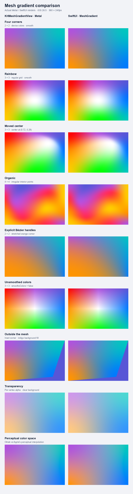
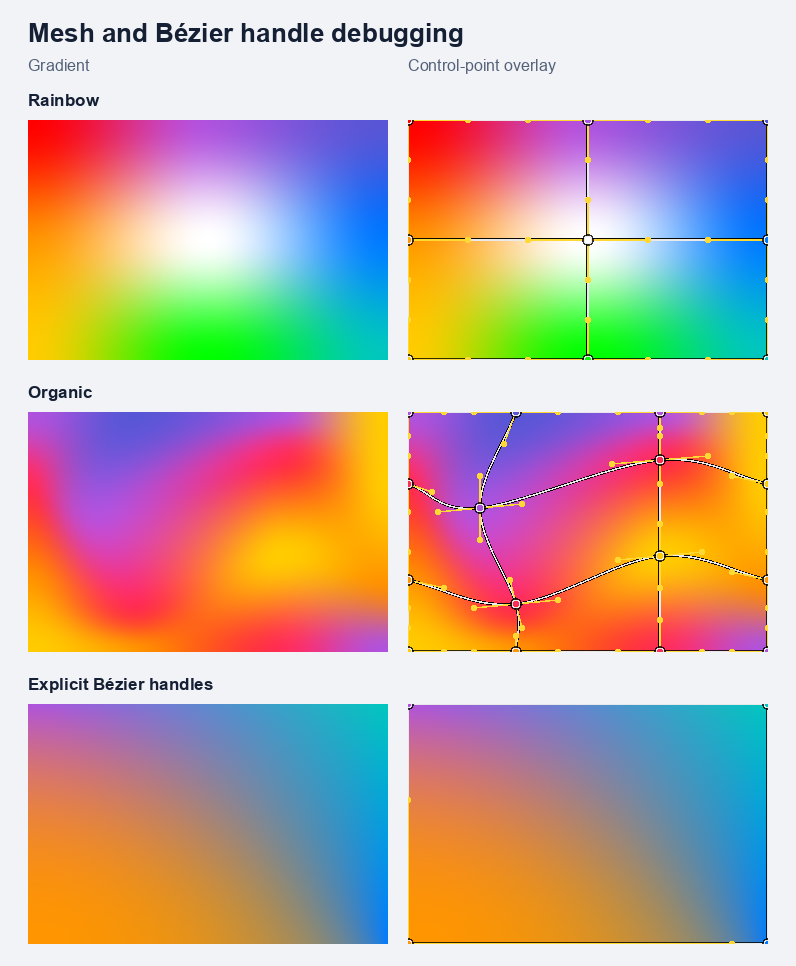

# KHMeshGradient

A Metal-backed, UIKit-native mesh gradient view for iOS 15 and later.

`KHMeshGradientView` uses UIKit properties, Core Animation interpolation, and a
custom `CAMetalLayer`. It does not wrap SwiftUI or require iOS 18. There are no
external package dependencies.



## Requirements

- iOS 15+ / Mac Catalyst 15+
- Swift 5.9+ and an Apple SDK with UIKit and Metal
- A Metal-capable device or Simulator
- The example's SwiftUI reference panels require iOS 18+. The UIKit panels work on older systems.

The package builds for a deployment target of iOS 15. All 15 tests pass on iOS
26.5 Simulator; the original 14-test suite also passed on iOS 18.2. Device Release
and Mac Catalyst builds pass. The checked-in comparisons were captured on iOS
26.5 Simulator. Physical-device benchmarks run on an M1 iPad Pro with iPadOS
18.6; pre-iOS-18 runtime testing remains to be done.

## Installation

Add this folder as a local Swift package in Xcode, select the `KHMeshGradient`
library product, and import the module:

```swift
import KHMeshGradient
```

Once this repository is published, it can also be added by its GitHub repository
URL using Xcode's **Add Package Dependencies**. It has not been published or tagged yet.

## Basic usage

```swift
let gradientView: KHMeshGradientView = KHMeshGradientView()
gradientView.meshSize = .init(width: 3, height: 3)
gradientView.points = [
	CGPoint(x: 0, y: 0), CGPoint(x: 0.5, y: 0), CGPoint(x: 1, y: 0),
	CGPoint(x: 0, y: 0.5), CGPoint(x: 0.5, y: 0.5), CGPoint(x: 1, y: 0.5),
	CGPoint(x: 0, y: 1), CGPoint(x: 0.5, y: 1), CGPoint(x: 1, y: 1),
]
gradientView.colors = [
	.red, .systemPurple, .systemIndigo,
	.systemOrange, .white, .systemBlue,
	.systemYellow, .systemGreen, .systemMint,
]
gradientView.smoothsColors = true
gradientView.colorSpace = .device
gradientView.layer.cornerRadius = 20
gradientView.clipsToBounds = true
self.addSubview(gradientView)

// Assign its frame in your view's layoutSubviews().
```

Positions and colors are row-major arrays with `width × height` elements.
Coordinates are normalized: `(0, 0)` is the top-left and `(1, 1)` is the
bottom-right. Coordinates outside that range are allowed. Keep rows and columns
ordered for an ordinary non-folded mesh. Folded patches are rendered, but their
overlap/compositing is not guaranteed to match SwiftUI.

Sequential configuration is supported. An incomplete or invalid configuration
clears the mesh and sets `configurationError`; it does not crash. Maximum grid
size is 4096 vertices. The default is a transparent 2 × 2 grid.

## Explicit Bézier handles

Start with generated handles and edit them, or provide an entirely custom array:

```swift
var vertices: [KHMeshGradientView.BezierPoint] = gradientView.resolvedBezierPoints
vertices[4].trailingControlPoint = CGPoint(x: 0.9, y: 0.35)
gradientView.bezierPoints = vertices
```

Each `BezierPoint` contains `position`, `leadingControlPoint`, `topControlPoint`,
`trailingControlPoint`, and `bottomControlPoint`. Handles are absolute normalized
coordinates, not offsets. Handles pointing outside the grid are unused.

Setting `points` clears `bezierPoints` and returns to automatic geometry. Setting
`bezierPoints = nil` also returns to automatic geometry using the current `points`.

## Color and background options

| Property | Behavior |
| --- | --- |
| `colors` | UIKit colors, including dynamic colors resolved against view traits |
| `resolvedColors` | Optional `[CGColor]`; selects already-resolved colors |
| `meshBackgroundColor` | Fills pixels outside the mesh only; defaults to clear |
| `backgroundColor` | Ordinary UIView background, visible through mesh transparency |
| `smoothsColors` | Cubic interpolation when true; bilinear colors when false |
| `colorSpace` | `.device` (encoded sRGB), `.perceptual` (Oklab), or `.linear` (linear-light sRGB) |

Setting `colors` clears `resolvedColors`. Setting `resolvedColors = nil` selects
UIKit colors again. Trait changes re-resolve dynamic colors without animation.
Color interpolation uses premultiplied alpha. Output is 8-bit sRGB; wide-gamut
inputs are converted to sRGB and out-of-gamut output is clipped. HDR output is not implemented.

## Animation

```swift
UIView.animate(
	withDuration: 1.5,
	delay: 0,
	options: [.curveEaseInOut, .beginFromCurrentState],
	animations: {
		gradientView.points[4] = CGPoint(x: 0.7, y: 0.3)
		gradientView.colors[4] = .systemPink
	},
	completion: nil
)
```

Point positions, explicit handles, vertex colors, and `meshBackgroundColor`
animate with ordinary `UIView.animate` blocks, including UIKit springs. Arrays
must retain their topology. Grid dimensions, interpolation mode, and debug mode
change immediately. Interruption starts from presentation values.

`UIViewPropertyAnimator` and interactive scrubbing are **not supported** in this
version. Its opaque UIKit actions cannot be retargeted safely with the basic
animation bridge. Do not use it to animate mesh properties.

## Rendering and debugging

No timer or permanent display link runs. Core Animation drives redisplay while
mesh properties animate. Unchanged snapshots skip GPU submission. A static mesh
keeps its last submitted image and does no recurring rendering work.

```swift
gradientView.debugMode = .mesh          // Patch edges and vertex markers
gradientView.debugMode = .controlPoints // Also show Bézier handles
gradientView.debugMode = .tessellation  // Sampled parameter grid within each patch
gradientView.debugMode = .none

gradientView.isRenderingSuspended = true
```



The tessellation debug mode shows an 8 × 8 inspection grid, not every emitted GPU
triangle. `subdivisions` controls actual triangle density (default 48 segments
per patch axis, clamped to 2...128).

The view suspends onscreen submissions when detached, explicitly hidden,
explicitly suspended, or when the app resigns active. Resume invalidates the
frame. For custom containers, explicitly suspend fully covered/offscreen views;
the library does not perform occlusion detection.

`renderedFrameCount` counts successful onscreen submissions. `presentationPoints`
exposes interpolated vertex positions. `renderingError` reports initialization or
synchronous rendering errors.

Optional diagnostics expose aggregate onscreen rendering measurements:

```swift
gradientView.collectsRenderingStatistics = true
gradientView.resetRenderingStatistics()
// Change or animate the mesh, then inspect after GPU work completes.
let statistics = gradientView.renderingStatistics
let gpuMillisecondsPerDraw = statistics.gpuFrameCount == 0 ? 0 :
	statistics.gpuFrameSeconds * 1000 / Double(statistics.gpuFrameCount)
gradientView.collectsRenderingStatistics = false
```

CPU statistics are wall times for snapshot creation, drawable acquisition,
encoding, and scheduling; they exclude public property setters. GPU times cover
completed command buffers and exclude display composition. Presentation counters
are available on device, not Simulator. Diagnostics default to off and retain
only counters. Reset isolates subsequent frames from earlier in-flight work.
See the [physical-device benchmark report](Documentation/Benchmarks/README.md)
for repeated SwiftUI comparisons, memory measurements, and 120 Hz stress cases.

For export and tests:

```swift
let image: UIImage = try gradientView.renderedImage(
	size: CGSize(width: 600, height: 400),
	scale: 2
)
```

This renders through Metal and waits for completion. It includes mesh background
and debug overlays, but not UIView background, clipping, transforms, or subviews.
Use it for occasional exports, not inside a frame loop.

## Example app and tests

Open `Example/KHMeshGradientExample.xcodeproj`, choose the
`KHMeshGradientExample` scheme, and run on an iPhone or iPad. The gallery has nine
comparison fixtures, Animate/Reset buttons, and a debug-mode selector. The
project is checked in; XcodeGen is only needed to regenerate it from `Example/project.yml`.

From the repository root:

```sh
xcodebuild -project Example/KHMeshGradientExample.xcodeproj \
	-scheme KHMeshGradientExample \
	-destination 'generic/platform=iOS Simulator' \
	-derivedDataPath DerivedData build
```

Run tests in Xcode with **Product → Test**, or use the same project/scheme with
`xcodebuild test` and a specific Simulator destination. Plain host-side
`swift test` is not appropriate for this UIKit package. Tests exercise GPU output,
patch continuity, invalid configurations, source switching, alpha/background
semantics, animation interpolation, springs, interruption, suspension, and idle
submission counts.

## SwiftUI comparison and limits

Both sides use identical positions, handles where explicit, colors, smoothing,
background, color space, output dimensions, and a light appearance. UIKit images
are rendered into actual Metal textures; SwiftUI images use `ImageRenderer`.
The contact sheet composites both onto white. Raw images and measurements are
in `Documentation/Comparisons`.

This is an independent renderer, not a pixel-identical reimplementation of
SwiftUI. Apple's automatic-handle inference, internal patch construction,
perceptual color math, tessellation, and antialiasing are not fully documented.
Irregular automatic geometry shows the largest differences in these fixtures.
Supplying equivalent explicit handles substantially reduces the geometric differences.

To regenerate all captures on an already booted iOS 18+ Simulator after building:

```sh
python3 -m pip install -r Scripts/requirements.txt
Scripts/export_comparisons.sh SIMULATOR_UDID
```

See [architecture](Documentation/Architecture.md) and
[comparison notes](Documentation/Comparisons/README.md) for details.

MIT licensed. This repository is prepared locally for a future public GitHub push.
